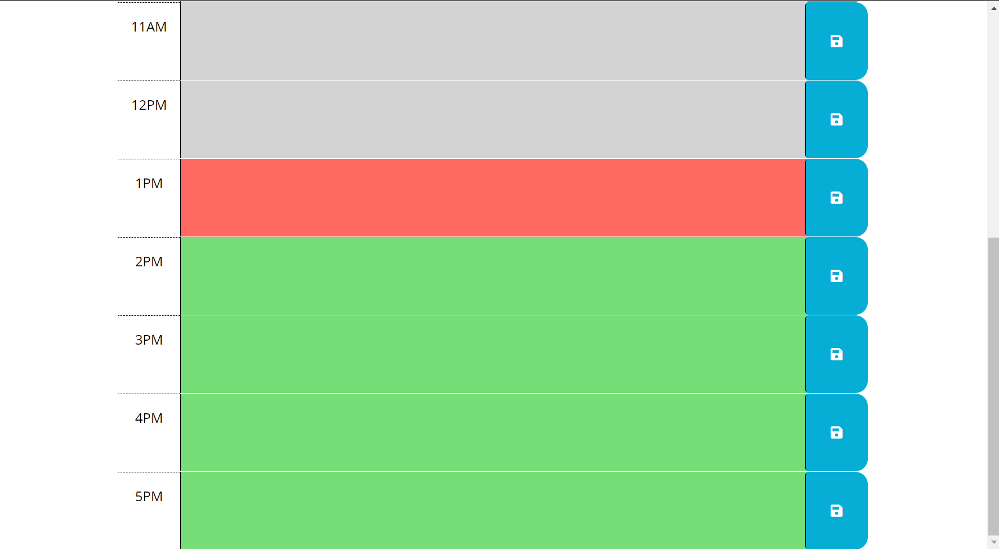

# Day-Planner

2/28/23

The purpose of this program is to create a work day planner that keeps the user on track with a color change function at the turn of each hour. It will also store any inputs in each of the text boxes to be brought out on openning the application.

https://m-vanhoose.github.io/Andromeda/

One of our TAs Kathryn Vincent helped me build the functionality to save and load information to the text input area on lines 60-80 of my script.js file.
